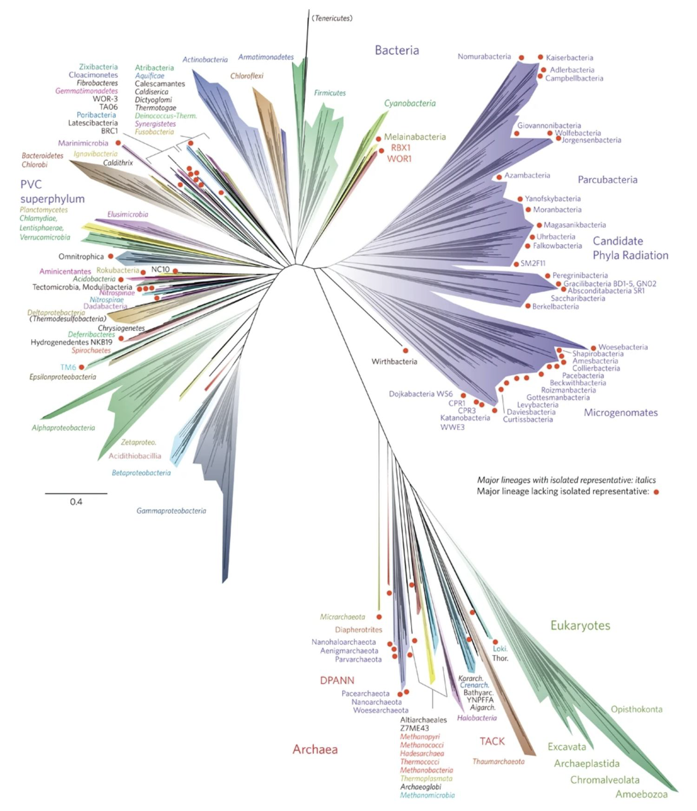

# Week 01

Earth BioGenome Project

## Phylogenetic Tree

A phylogenetic tree describes the evolutionary relationships between different species.

Example of phylogenetic tree:

### Findings: wanderlust of humans

Sequencing mitochondrial DNA => origin of human is Africa

[wk1 P14](slides/01-1.pdf#page=14)

## Factor

### Genetic Drift

1. By Chance
2. Influenced by population (larger population can be less impacted)

[Evidence: offsprings of 20 survivors in Pingelap](slides/01-1.pdf#page=18)

## Methods to Study

- Sorting Tolerant from Intolerant (SIFT)
- Genomic evolutionary rate profiling (GERP)

MSA Mul

mono

locus

allelo

haplotype

# Fst

- Positive Selection => Fst ↑
  - local adaptive: some place may be useful other place may be neutral
  - increase the difference
- Negative Selection => Fst ↓

## Problems

Wednesday => go to population level

