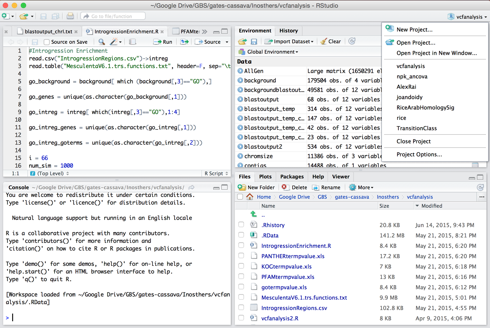

# R Basic

## Basic Syntax

variables are **case sensitive**

- `Object` to get the contents of the Object
- `Object` is an object, `"Object"` is a string

```r
Hello # to get the contents of the variable named Hello

"Hello" # string Hello
```

### Comment

the words after `#` will not be processed

```r
x<-1 #everything on the right side is a comment.
```


## R Session

### Default Workspace

- Workspace contains the different R objects and function only (not the commands)
- The name of the default workspace is saved as .RData
- To load .RData, set the directory where .RData is located as current directory and then select to “load Default workspace”

### Working Directory

- It is a good idea to have separate workspace and history for different projects saved in different directories (folders)

```r
getwd() # Getting you working directory

setwd("R_project_folder") # Changing your working directory

save.image("Name_of_workspace.RData") # Save a workspace

load("Name_of_workspace.RData") # Load a workspace

dir() # List the contents of your working directory
```

## RStudio Projects



## Package

Packages such as Bioconductor are available on CRAN. They contain specialized functions and data that can be used for your analysis.

```r
library() # view the packages installed

install.packages(cluster) # install a library

library(cluster) # load a library
```

## Getting Help

```r
# get help of a command
help(mean)
?mean

# In case you don’t know the full name of the command
apropos("mean")

# To only get an example of how to use the command
example("mean")
```

# Types

## Object & Function

### Object

- Container for a piece of data or lines of code.
- Objects can be named so they can be accessed at any point.
- Three ways to assign data to a named object:

```r
x <- 1

assign("x", 1)

x = 1
```

#### <- VS =

They are same in 99% of time.

Differences: `<-` will always assign values, while `=` not work in arguments.

```r
mean(x = c(1, 2, 3))
x # object 'x' not found

mean(x <- c(1, 2, 3))
x # 1 2 3
```
#### Mode and Class

- Mode is the "type" of the components (how it is stored)
- Class is the same as a mode (more for programming, the )

| components | Mode | Class |
| :-- | :-- |
| Numeric | numbers |
| complex number | complex |
| logical | True False |
| Character | alphanumeric |
| Raw | bytes |

### Function

Functions contain lines of pre-written code that performs some task.

- Gather information about R environment
- Change properties of an environment ○ Perform task on one or more data structures ○ Below is an example of the function sum()

### Vector

- Most basic data structure
- 1D, can store 1 or more
- `c()` to create more than one element
- `NA` for missing data

## Vector and Matrix

Vector: 1 dimensional, same type

Matrix: 2D, same type

**input another type, convert to string**


DataFrame: can different types

- column same type


List: 1D, every

`$` Get the object of a list | column of a DataFrame

# Loops and if-else

## Apply


## Human Mistakes in Statistics

Sometimes the sheet is scanned. The latter may be wrong like ()


# Format

## CSV

Comma separated values

sometimes the separator may not be `,` , so if 


# 英语

assign: 赋值