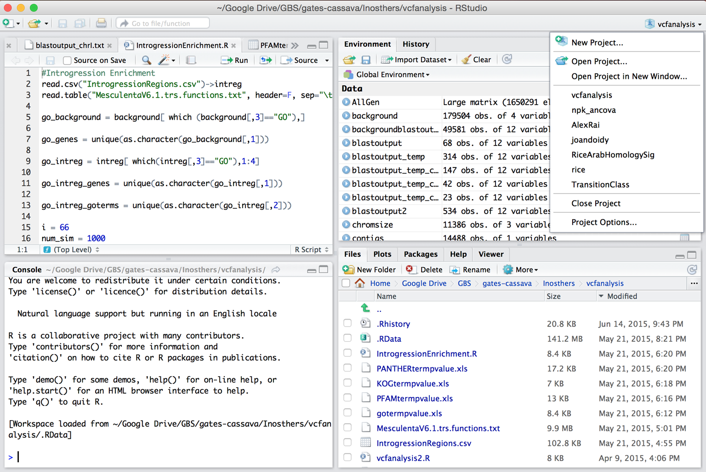

# R Basic

Importance:

1. [Vector](#vector), [Matrix](#matrix), [DataFrame](#dataframe)
2. [apply](#apply)

## Basic Syntax

variables are **case sensitive**

- `Object` to get the contents of the Object
- `Object` is an object, `"Object"` is a string

```r
Hello # to get the contents of the variable named Hello

"Hello" # string Hello
```

### Comment

the words after `#` will not be processed

```r
x = 1 #everything on the right side is a comment.
```

## R Session

### Default Workspace

- Workspace contains the different R objects and function only (not the commands)
- The name of the default workspace is saved as .RData
- To load .RData, set the directory where .RData is located as current directory and then select to "load Default workspace"

### Working Directory

- It is a good idea to have separate workspace and history for different projects saved in different directories (folders)

```r
getwd() # Getting you working directory

setwd("R_project_folder") # Changing your working directory

save.image("Name_of_workspace.RData") # Save a workspace

load("Name_of_workspace.RData") # Load a workspace

dir() # List the contents of your working directory
```

## RStudio Projects



## Package

Packages such as `Bioconductor` are available on `CRAN`. They contain specialized functions and data that can be used for your analysis.

```r
library() # view the packages installed

install.packages(cluster) # install a library

library(cluster) # load a library
```

## Getting Help

```r
# get help of a command
help(mean)
?mean

# In case you don’t know the full name of the command
apropos("mean")

# To only get an example of how to use the command
example("mean")
```

# Types

## Object & Function

### Object

- Container for a piece of data or lines of code.
- Objects can be named so they can be accessed at any point.
- Three ways to assign data to a named object:

```r
x <- 1

assign("x", 1)

x = 1
```

#### <- VS =

They are same in 99% of time.

Differences: `<-` will always assign values, while `=` not work in arguments.

```r
mean(x = c(1, 2, 3))
x # object 'x' not found

mean(x <- c(1, 2, 3))
x # 1 2 3
```
#### Mode and Class

- Mode is the "type" of the components (how it is stored)
- Class is the same as a mode (more for programming, the type of object)

See the [example below](#matrix)

| components | Mode | Class |
| :-- | :-- | :-- |
| Number | numeric | numeric |
| complex number | complex | complex |
| True False | logical | logical |
| alphanumeric | character | character |
| Raw | bytes | bytes |

### Function

Functions contain lines of pre-written code that performs some task.

- Gather information about R environment
- Change properties of an environment ○ Perform task on one or more data structures ○ Below is an example of the function sum()

## Vector

- **Most basic** data structure
- 1D, can store 1 or more
- `c()` to create more than one element
- `NA` for missing data (Not Available)

Type of Vector

- [character vectors](slides/01-intro-to-r.pdf#page=32)
- [logical vectors](slides/01-intro-to-r.pdf#page=33)

### Difference of R and other language: 

1. The operator will impact every element of the vector.
2. r tend to use operator on numeric things

```r
"123" + "456"
# Error in "123" + "456" : non-numeric argument to binary operator

# while in python or other language, the result is "123456"

paste("123", "456", sep = "")
# "123456"
```

### Name and Slice of Vectors

```r
x = 1:4
names(x) = c("A", "B", "C" ,"D")
x # now is the named int[1:4]
# A B C D 
# 1 2 3 4 
```

input a vector to get the elements of a vector

1. index (from 1 not 0)
2. name

```r
x[2] # get the second element
x[2:4] # get second to forth elements

x["B"] # get the element named B
x[c("B","D")] # get the elements named B and D
```

## Factor

- used for group items together
- identical names will be divided into same group

```r
test1 = c(1, 2, 3, 2)
test2 = c(2, 1, 3, 4)

test_group = factor(c("treatment", "treatment", "control", "control"))
```

## Matrix

- 2D data with same type

```r
> mode(matrix(c(1,2,3,4), 2))
[1] "numeric"
> class(matrix(c(1,2,3,4), 2))
[1] "matrix" "array" 

```

How to create Matrix

1. `matrix(x, nrow= , ncol= )`
2. `dim(x) = c(row, col)` x will be changed
3. `cbind(vectors)` and `rbind(vectors)` 
   - c for column
   - r for row  

```r
x = 1:12
dim(x) = c(3,4)
x
#     [,1] [,2] [,3] [,4]
#[1,]    1    4    7   10
#[2,]    2    5    8   11
#[3,]    3    6    9   12
```

## DataFrame

- list of vectors of same length
- perfect structure for mixed-type data

Get data out:

1. `DataFrame$column`
2. `DataFrame[column,row]`

name the row and column

1. `rownames()`
2. `colnames()`

## List

-  a collection of objects (vectors, matrices, and dataframes of different lengths)
-  can storage different types
-  access element: `[[index]]`

```r
x = list(c(123,234),"345")
x # list of 2
# [[1]]
# [1] 123 234
# 
# [[2]]
# [1] "345"

y = x[1]
y # list of 1

z = x[[1]]
z # a vector
```

## Some Useful Function

- `sample()` - Get a random sample of numbers
- `order()` – Returns a numeric vector of the element position in ascending order
- `sort()` – Returns the values in ascending order
- `paste()` – Create a character vector by concatenating two other vectors
- `print()` – Prints content of an object to screen
- `range()` – Returns minimum and maximum value of a vector
- `t()` – Transpose a matrix or dataframe

# Own Function

Aims

- reuse the codes for you and others
- `apply` function  to make your code more efficient.


## structure

- Name
- arguments: the elements required by your computation
- expression: r will automatically return the last calculated data

```r
name = function(argument1, argument2, …) { 
    Expression
    return (myresults) # you have to use brackets here
}
```

## Example

```r
square = function(x){
  return (x * x)
}

square(25) # 625
```

# Control Statements

## if-else

- nest if to use else if
- ifelse is a function in R

```r
if(a>5) {
    print(a) 
} else {
    print("a is less than 5")
}

else if () {} # is error in R, you should nest it

if(a < 5) {
    print("a is < 5")
} else {
    if(a < 10) {
        print("a is < 10 but >= 5")
    } else {
        print ("a is >= 10")
    }
}
```

## ifelse

`ifelse` can be used to evaluate a vector of longer length

`ifelse(condition, statements to execute if TRUE, statement to execute if FALSE)`

```r
a<-c(1:8)
ifelse(a <= 5, a, "greater than 5")
# "1" "2" "3" "4" "5" "greater than 5" "greater than 5" "greater than 5"
```

## loops

### for

go through a iterable object, same as python

```r
for (i in 1:length(a)) { }
```

### while

while loops evaluate a condition and loops until it is no longer true

```r
i = 1
while (i <= 10) {
    print(i)
    i = i + 1
}
```

### repeat

No condition required. It iterates until `break` is called.

```r
repeat {
    …
    if(a>4)
        break
}
```

### Apply

The functions `apply()`, `tapply()`, `lapply()`, `sapply()` allows you to perform a specified function across array objects.

Example [r markdown](recitation/01-basic-r.rmd)

# Plotting

Go to [slide P24](slides/02-function-flow-control-plot-in-r.pdf#page=24)

# Load Data

## Human Mistakes in Statistics

Sometimes the sheet is scanned. The latter may be wrong like ()

## CSV

Comma separated values

sometimes the separator may not be `,` , so if 


# 英语

assign: 赋值