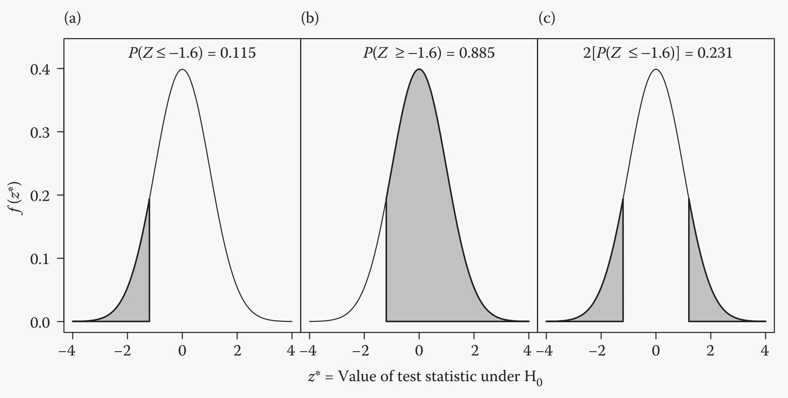

# Hypothesis Testing

## Null Hypothesis

The null hypothesis (Ho) is often the statement that there is simply no effect or no difference between either two sample populations.

## Significance Testing

### P-value

The probability getting this distribution.

### Interpretation of significance

If the p-value is low and the HO is rejected, it doesn’t mean the HO is wrong. It means that there is a small probability to get the test statistic score if HO was true.

#### Upper, Lower, two-tailed tests

[slides](slides/06-1-hypothesis-testing.pdf#page=9)

### Two Population Means

- unpaired
  - $\overline{X}-\overline{Y} \sim N[\mu_X -\mu_Y, (\sigma_X^2/n_X+\sigma_Y^2/n_Y)]$
- paired: D for difference
  - $t*=\frac{\overline{X}_D-D_0}{S_D/\sqrt{n}}$

#### Equal and Not equal Variance

For unpaired t-test

[slides](slides/06-1-hypothesis-testing.pdf#page=15)

#### Type I II Errors

- Type I: reject but you should
- Type II: accept but you shouldn't

### Methods